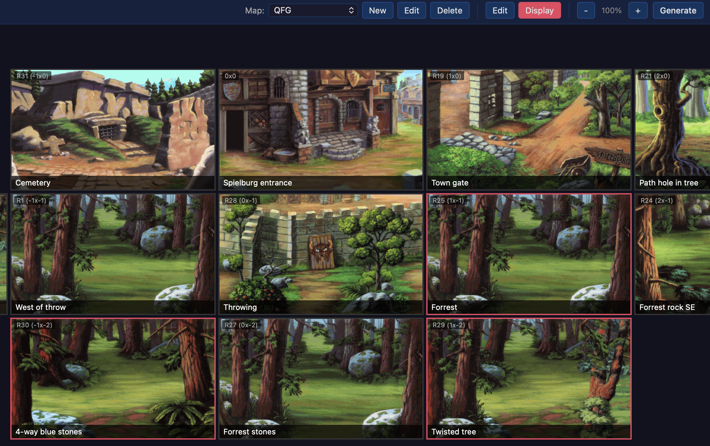

<p align="center">
  
</p>

# AGS Map Editor

A desktop application for visually designing room maps for [Adventure Game Studio](https://www.adventuregamestudio.co.uk/) (AGS) projects.



## Overview

AGS Map Editor lets you lay out your game's rooms on a spatial grid, assign AGS room numbers, attach concept art, and add notes — all saved directly into your AGS project folder. It gives you a bird's-eye view of how your game world fits together.

When you are ready click `Generate` and AGS Map Editor will create and update your AGS room files including the `room_Leave` functions with `player.ChangeRoomAutoPosition();` function pointing to the adjacent room.

## Download

Download the latest installer for your platform from [GitHub Releases](https://github.com/pointandorclick/ags-map-editor/releases):

| Platform | File |
|----------|------|
| Windows | `.exe` (NSIS installer) |
| macOS | `.dmg` |
| Linux | `.AppImage` or `.deb` |

> **Note:** The macOS build is not currently code-signed. When you first open the app, macOS will block it. To allow it, run the following in Terminal:
>
> ```bash
> xattr -cr /Applications/AGS\ Map\ Editor.app
> ```
>
> Then open the app normally.

## Getting Started

1. In AGS create a new Room then under room events add the 4 room_Leave events via the UI. Leave everything else blank and not the Room ID. (This is required so AGS Map Editor knows the screen dimensions of your game and allows creation of the room_Leave functions automatically)
2. Launch the app and click **Open AGS Project...** (or select a recent project) and point it at a AGS game directory (it must contain a `Game.agf` file).
3. You will be prompted for a file to use as the Base room. Select the Room ID that you created in step 1. This will be used to create new rooms via the generate command. **You can now delete/re-use this room within AGS** (AGS Map Editor has duplicated it).
4. Create your first map
5. Start building your map by clicking the **+** buttons to add rooms to the grid.
6. Drag image files onto the rectangles to assign backgrounds.
7. Click on a room to add more details.

## Generating rooms in AGS

Once you are happy with your map layout (a work in progress is okay!) you can click the Generate button this will:

1. Create any rooms that do not have a room ID in your map.
2. Add room_Leave<Direction> functions to all rooms and use `player.changeRoomAutoPosition()` to point to any adjacent room.
3. Add and update room Descriptions field for each room so you can reference them in game and on your map.
4. Present you with a list of what has been completed (Don't close this yet, see below).

Once this is complete you will need to:

1. Add background images. AGS Map Editor can't automatically assign the background but the image you used on the map is conveniently in your project root under a folder named `Backgrounds`. The file name will match the room name.
2. Create edges by dragging the yellow edge marker to the appropriate spot on each side.
3. (Optional) If there are edges that you won't use, you can remove the room_Leave function and event.
4. Go back to AGS Map Editor and click "complete" on any room that no longer requires updating. This helps when you may have rooms that are transported via regions instead of edges and you don't want AGS Map Editor to keep adding in the room_Leave function each time you generate.
5. Edit the room(s) as normal.

## Core Concepts

### Base Room

When you first open a project, the editor prompts you to select a **base room** — an existing `.crm` file from your AGS project that will be used as the starting point for new rooms. During generation, any room that doesn't already have a `.crm` file will get a copy of the base room. This gives new rooms the same dimensions, hotspot layout, walkable areas, and other properties as the base.

You can change the base room at any time from **Settings**. Set it to "(None)" to skip `.crm` generation entirely.

### Maps

A map is a named collection of rooms arranged on a 2D grid. A single project can have multiple maps — useful for organizing separate regions, floors, or acts of your game. Use the toolbar dropdown to switch between maps, and the **New / Edit / Delete** buttons to manage them.

### Rooms

Each cell on the grid represents a room. In **Edit mode**, **+** buttons appear on empty adjacent cells so you can expand the map in any direction. Rooms can be moved around the grid by dragging, and deleted from the edit panel.

Click a room to open its edit panel where you can set:

- **Room ID** — the AGS room number this cell corresponds to (e.g. Room 1, Room 305)
- **Title** — a short label displayed on the cell
- **Notes** — free-text notes for design documentation
- **Image** — drag-and-drop concept art or a screenshot onto a room cell
- **Complete** — a checkbox flag meaning "skip AGS code generation" for this room

### Templates

Right-click a room that has an image to mark it as a **template**. Templates are reusable room designs that can be assigned to other rooms, reducing repetitive work when many rooms share a similar layout. Templates are represented with a red border around them on the map for reference only.

### Display Mode

Toggle to **Display mode** for a compact, read-only view of the map with zoom controls (25%–200%). Click any room to view its details in a modal.

## The `.agm` Project File

When you save, the editor writes a **`<ProjectName>.agm`** file into your AGS project directory (alongside `Game.agf`). This is a JSON file containing all maps, rooms, templates, and editor state. It is the single source of truth for your map data.

```
MyGame/
  Game.agf          ← AGS project file
  MyGame.agm        ← Map editor data (auto-generated)
  ...
```

The `.agm` filename matches the project directory name. Changes are auto-saved as you edit.

## How AGS Rooms Are Mapped

Each room cell on the grid can be assigned an **AGS Room ID** — the number that corresponds to a `roomXX.crm` / `roomXX.asc` file in your AGS project. The editor provides a dropdown of available room IDs (1–18 and 300–308) and prevents you from assigning the same room ID to multiple cells within a map.

This mapping is purely organizational: it connects a spatial position on your map to an AGS room number, helping you visualize which rooms connect to each other and plan your game's world layout.

## Development

### Prerequisites

- [Node.js](https://nodejs.org/) v18+
- [Rust](https://www.rust-lang.org/tools/install) (latest stable)
- Tauri CLI v2 (installed via npm)

### Setup

```bash
npm install
```

### Run (development)

```bash
npm run dev
```

### Build (production)

```bash
npm run build
```

Produces platform-specific bundles (`.app` on macOS, `.msi` on Windows, `.deb` on Linux).

### Releasing

Releases are built automatically by GitHub Actions when a version tag is pushed. Use the release script:

```bash
./release.sh 0.2.0
```

This bumps the version in `tauri.conf.json`, `Cargo.toml`, and `package.json`, commits, tags, and pushes. The workflow builds for all platforms and creates a **draft release** on GitHub. Go to [Releases](https://github.com/pointandorclick/ags-map-editor/releases), review the draft, and publish it.

## License

GNU General Public License v3.0
